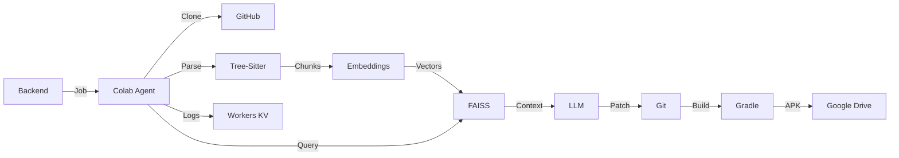

# MrX Colab Agent - Android App Builder

> AI-powered Android development agent running on Google Colab

## 🎯 What This Does

This Colab agent is the computational engine for the MrX App Builder platform. It:

- 🔍 **Parses Android projects** using Tree-Sitter (Java, Kotlin, XML)
- 🧠 **Creates semantic code embeddings** using local transformer models
- 📊 **Builds FAISS vector indexes** for intelligent code retrieval
- 🤖 **Generates code patches** with AI (GPT-4, Claude, or custom LLMs)
- 🔨 **Builds APKs** using Gradle
- 🔄 **Auto-fixes build errors** with AI repair loops
- ☁️ **Integrates with GitHub** for version control
- 📦 **Uploads APKs to Google Drive**
- 📡 **Streams logs** to your dashboard via Workers KV

## 📁 Project Structure

```
mrx-colab-agent/
├── main.ipynb                 # Main Colab notebook - START HERE
├── requirements.txt           # Python dependencies
├── config/
│   ├── settings.py           # Configuration management
│   └── secrets.py            # Secure credential handling
├── core/
│   ├── auth.py               # Backend authentication
│   └── job_manager.py        # Job lifecycle management
├── parsers/
│   └── tree_sitter_parser.py # Code parsing with Tree-Sitter
├── chunking/
│   └── chunker.py            # Semantic code chunking
├── embeddings/
│   └── model_loader.py       # Local embedding models
├── vector/
│   └── faiss_manager.py      # FAISS vector search
├── git/
│   └── repo_manager.py       # Git operations
├── llm/
│   ├── prompt_builder.py     # RAG prompt construction
│   └── llm_client.py         # LLM API client
├── build/
│   └── gradle_executor.py    # Gradle build automation
├── storage/
│   ├── kv_client.py          # Workers KV integration
│   └── log_streamer.py       # Log streaming
└── utils/
    ├── logger.py             # Structured logging
    └── retry.py              # Retry logic
```

## 🚀 Quick Start

### 1. Open Google Colab
Go to [colab.research.google.com](https://colab.research.google.com)

### 2. Upload Files
Upload all `.py` files maintaining the folder structure

### 3. Open main.ipynb
Copy the notebook code or upload the `.ipynb` file

### 4. Configure (Cell 2)
```python
BACKEND_URL = "https://your-app.pages.dev"
COLAB_ID = "colab-001"
CLAIM_SECRET = "your-secret"
os.environ["GITHUB_PAT"] = "ghp_your_token"
```

### 5. Run All Cells
Execute cells 1-6 in order. Cell 6 starts the agent.

## ⚙️ Configuration

### Required Settings

| Variable | Description | Example |
|----------|-------------|---------|
| `BACKEND_URL` | Your Cloudflare Pages URL | `https://app.pages.dev` |
| `COLAB_ID` | Unique Colab instance ID | `colab-001` |
| `CLAIM_SECRET` | Job claiming secret | `secret-123` |
| `GITHUB_PAT` | GitHub Personal Access Token | `ghp_abc123...` |

### Optional Settings

| Variable | Description | Default |
|----------|-------------|---------|
| `OPENAI_API_KEY` | OpenAI API key | None |
| `CUSTOM_LLM_ENDPOINT` | Custom LLM URL | None |
| `DEFAULT_EMBEDDING_MODEL` | Embedding model | `mini` |
| `POLL_INTERVAL` | Job poll interval (seconds) | `30` |
| `GRADLE_TIMEOUT` | Build timeout (seconds) | `600` |

## 🔧 Supported Models

### Embedding Models
- `mini` - all-MiniLM-L6-v2 (Default, 384d, fastest)
- `bge-small` - bge-small-en-v1.5 (512d)
- `bge-base` - bge-base-en-v1.5 (768d)
- `mpnet` - all-mpnet-base-v2 (768d)

### LLM Support
- OpenAI (GPT-3.5, GPT-4)
- Anthropic Claude (via custom endpoint)
- Any OpenAI-compatible API

## 📊 How It Works



1. **Job Polling**: Agent polls backend every 30s for jobs
2. **Repository**: Clones/updates Android project from GitHub
3. **Parsing**: Tree-Sitter extracts classes, functions, XML views
4. **Chunking**: Creates semantic code chunks with metadata
5. **Embedding**: Generates vectors using local transformer models
6. **Indexing**: Builds FAISS index for similarity search
7. **Retrieval**: Finds relevant code for user query
8. **LLM Call**: Sends retrieved context to AI for code generation
9. **Patching**: Applies generated code changes
10. **Building**: Runs Gradle to compile APK
11. **Auto-fix**: Retries with error context if build fails (3x)
12. **Upload**: Pushes APK to Google Drive
13. **Logging**: Streams progress to dashboard

## 🔒 Security

- ✅ Credentials stored in runtime memory only
- ✅ No secrets in notebook code
- ✅ TLS for all network communication
- ✅ GitHub PAT with minimal permissions
- ✅ Optional Colab Secrets integration
- ✅ Audit logs for all operations

## 📈 Performance

- **Parse speed**: ~5s per 1000 lines
- **Embedding**: ~3s per 1000 chunks
- **FAISS build**: ~10s for full project
- **Retrieval**: <100ms per query
- **Build time**: 2-10 minutes (depends on project)

## 🐛 Troubleshooting

### Agent won't start
1. Check backend URL is correct
2. Verify CLAIM_SECRET matches backend
3. Ensure GitHub PAT is valid

### Build fails
1. Check project has valid `build.gradle`
2. Verify Android SDK requirements
3. Increase GRADLE_TIMEOUT if needed

### Can't clone repo
1. Verify GitHub PAT has `repo` permission
2. Check repository URL is correct
3. Ensure repo exists and is accessible

### Out of memory
1. Reduce EMBEDDING_BATCH_SIZE
2. Use smaller embedding model (`mini`)
3. Filter files with retrievalFilters

## 📚 API Reference

### Job Types

**build-and-patch**
```json
{
  "type": "build-and-patch",
  "payload": {
    "patchRequest": "Add login screen with Material Design",
    "buildVariant": "release",
    "chatHistory": [...],
    "retrievalFilters": {
      "folders": ["app/src/main/java"],
      "paths": []
    }
  }
}
```

**build-only**
```json
{
  "type": "build-only",
  "payload": {
    "buildVariant": "release",
    "clean": false
  }
}
```

**index-update**
```json
{
  "type": "index-update",
  "payload": {
    "retrievalFilters": {...}
  }
}
```

## 🔗 Integration

### Backend API Endpoints
- `POST /api/jobs/claim` - Claim next job
- `PATCH /api/jobs/{id}` - Update job state
- `GET /api/admin/secrets` - Fetch secrets
- `PUT /api/kv/{key}` - Store KV data

### Workers KV Keys
- `project:{id}:meta` - Project metadata
- `project:{id}:job:{jobId}` - Job state
- `project:{id}:logs:{jobId}:segment:{n}` - Log chunks
- `project:{id}:faiss:manifest` - Index metadata
- `artifact:{id}:{buildId}` - APK metadata

## 📝 License

MIT License - See LICENSE file

## 🤝 Contributing

1. Fork the repository
2. Create feature branch (`git checkout -b feature/amazing`)
3. Commit changes (`git commit -m 'Add amazing feature'`)
4. Push to branch (`git push origin feature/amazing`)
5. Open Pull Request

## 📞 Support

- 📖 Documentation: See `DEPLOYMENT_GUIDE.md`
- 🐛 Issues: GitHub Issues
- 💬 Discussions: GitHub Discussions

## 🎉 Credits

Built with:
- Tree-Sitter for parsing
- Sentence Transformers for embeddings
- FAISS for vector search
- GitPython for Git operations
- Google Colab for compute

---

**Ready to build Android apps with AI? Start with `main.ipynb`!** 🚀